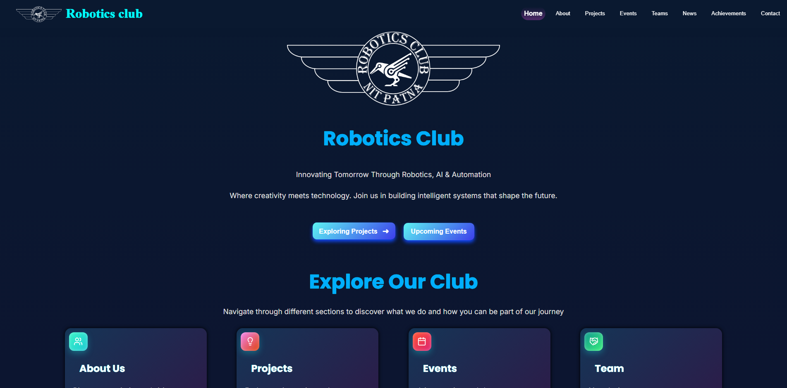
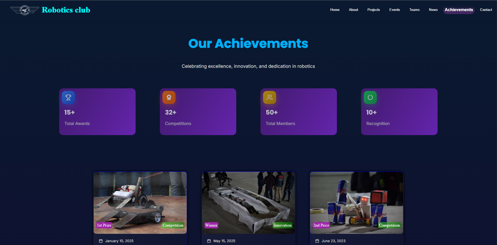
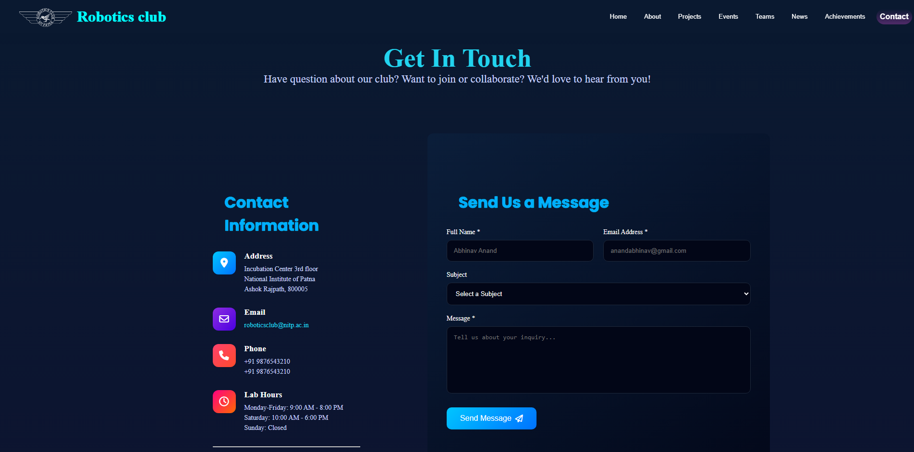
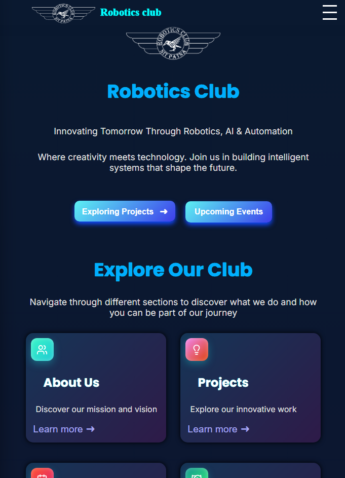
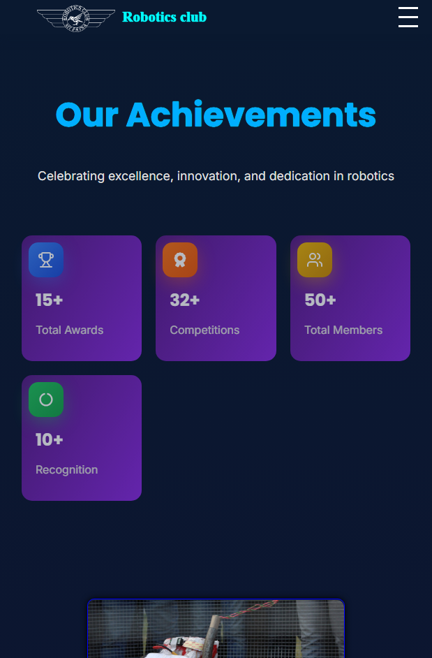
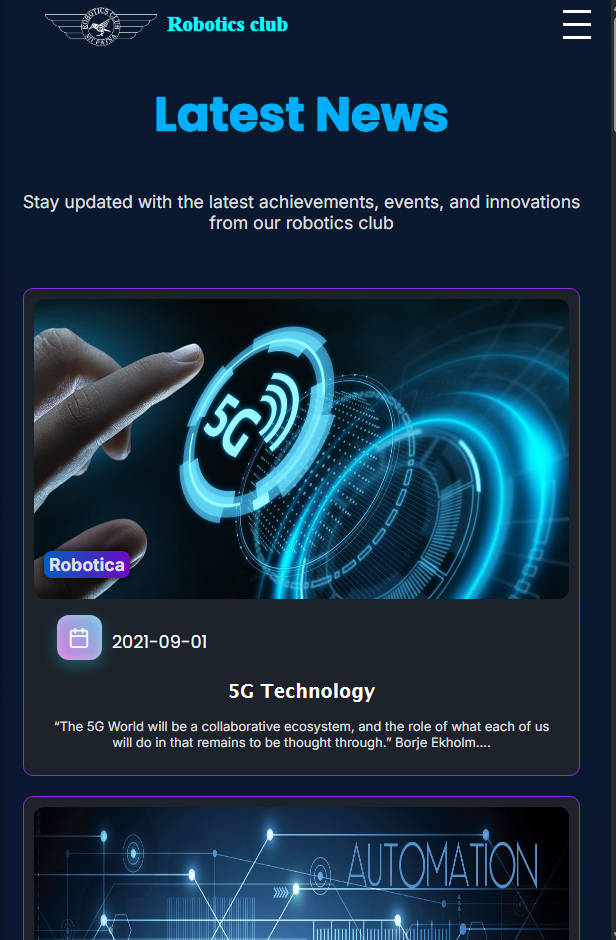

# ***Robotics Club Website***

## Breif explaination:

The Robotics Club website was designed with one core idea in mind: keep it fast, clean, scalable, and good enough to intrigue both humans and robots.  Since this is a front-end–focused project, we leaned heavily into modern web technologies that promote modularity, performance, and maintainability.  

We chose React as the backbone because it allows the UI to be broken into reusable components: which is perfect for pages like projects, teams, and events that have noticable repeating patterns. This modular approach also makes future updates simple. JavaScript ensues all logic, using built-in language methods like map() and filter() to dynamically render content efficiently.  

For development speed, Vite was used as the build tool. It offers lightning-fast hot reloading and a smoother developer experience compared to traditional setups. CSS ensures the site remains responsive across devices, while SVG icons were used to maintain visual clarity at any resolution.  

To add life to the interface, we integrated Motion (Framer Motion) for smooth, lightweight animations that enhance user experience without sacrificing performance. Version control via Git enabled seamless team collaboration, and VS Code provided a flexible and scalable development environment.  

Future scalability was a key consideration. The use of structured data objects (contentData) and page-based .jsx files allows new content and pages to be added with minimal effort—plug, play, deploy.  

Summary: modern tools, smart structure, smooth animations, and room to enhance.

## Team members:

|      Name       |    Roll No.    |    Phone No.   |            Email            |
| :---            | ---:           | ---:           | :---                        |
|Vishesh Meena    |         2504085| +91 95093 93627|visheshmeena47@gmail.com     |
|Kartikey Gangwar |         2504072| +91 91196 34692|kartikeygangwar90@gmail.com  |
|Abhinav Anand    |         2504098| +91 93047 61334|anandabhinav171@gmail.com    |
|Kanak Kumari     |         2504004| +91 80028 25665|kanakkansyakar.8804@gmail.com| 

# Technology:  

## Languages:  
- **HTML:**  
&nbsp;&nbsp;Used for startup of the main project via &lt;script/&gt; tag running the JavaScript program.
- **CSS:**  
&nbsp;&nbsp;Used for efficient, responsive and portable rendering of the website.
- **JavaScript:**  
&nbsp;&nbsp;Used as the main language for the interface with all libraries and frameworks.

## Tools used:  
- **Vite:**  
&nbsp;&nbsp;Next-generation front-end build tool to dramatically speeds up web development.
- **Git:**  
&nbsp;&nbsp;Open-source version control system to make working on a group project more convenient.
- **Visual Studio Code:**  
&nbsp;&nbsp;A light-weight modern IDE and text editor for scalable work environment.
- **SVG:**  
&nbsp;&nbsp;A vector based XML image that can be scaled infinitely without losing any quality, used for icons.  
- **Vite-Plugin-SVGR:**  
&nbsp;&nbsp;Used to transform SVGs into importable React components for better styling control.
- **Firebase:**  
&nbsp;&nbsp;For fast, secure hosting for web apps.

## Frameworks and libararies:
- **React:**  
&nbsp;&nbsp;A versatile library for modular and scalable front-end development, which is easy to use and deploy.
- **Motion (previously Framer Motion):**  
&nbsp;&nbsp;A lightweight animation library which is built specifically for React, directly deployable and used in mainstream development.

## What's it about (features):  
A fully human developed professional front-end complete 8 page static responsive website.  
Using modsularised system via objects and React.js utilising the language features(JavaScript) such as map() : filter() and for_each().  
Using svg (a vector based icon images for resizing icons without losing any quality).
Used framer motion for fast and light-weight motions and animations.

# Future scalability:
Making a `contentData` object to make developing a card of information such as `projects` and `team members` which contains
data {type, icon, title, style, description, information} required for easier card generation.  
Making different react documents for each page made in the website, which is easily integratable by just adding a file with the extension `.jsx` in the `pages` directory.

# External resources:
**Robotics club icon:** Robotics club faculty : whatsapp group.  
[React documentation](https://react.dev/learn)  
[Vite documentation](https://vite.dev/guide/)  
[Framer motion](https://motion.dev/)  
[Photos](https://roboticsnitp.co.in/)  
[Icons](https://fontawesome.com/)  

# Screenshots:

## PC view:
### Homepage:

### Achievement:

### Contact:

## Mobile view:
### Homepage:

### Achievement:

### News:

# How to run:

## Hosted website:
[Robotics Club Website](https://robotics-club-f92d5.web.app/)

## Local web host:

Follow these steps to run the project locally. Ensure you have [Node.js](https://nodejs.org/en) installed.

1. **Open Terminal.**
2. **Clone the repository:**  
`git clone https:/github.com/UnqGit/Robotics_Club_Website`
3. **Change directory:**  
`cd .\Robotics_Club_Website\robotics_club\`
4. **Install all the dependencies:**  
`npm install`
5. **Run this command to host the website on localhost:**  
`npm run dev`  